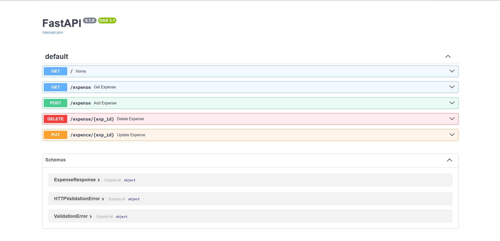

# 💰 Expense Tracker (CLI + PostgreSQL)

## 🚀 Overview
A command-line based expense tracker built with Python and PostgreSQL, supporting full CRUD operations.

## ⚙️ Features
- Add expense
- View all expenses
- Update expense
- Delete expense
- Calculate total spending

## 🛠 Tech Stack
- Python
- PostgreSQL
- psycopg2

## 📂 Project Structure
expense-tracker/
│── api.py
│── db.py
│── models.py
│── requirements.txt
│── README.md
│── .gitignore 

## ▶️ How to Run Locally
 1. Clone the repository

git clone URL
cd expense-tracker

 2. Install dependencies

pip install -r requirements.txt

 3. Setup PostgreSQL

Create a database and update credentials in `.env`

 4. Create `.env` file

DB_HOST=localhost
DB_NAME=1st
DB_USER=postgres
DB_PASS=PASSWORD
DB_PORT=5432

5. Run the server

python -m uvicorn api:app --reload

6. Open API Docs

http://127.0.0.1:8000/docs

---

## 🌐 Live API
(Add after deployment)

## 📌 API Endpoints

- `GET /expense` → Get all expense
- `POST /expense` → Add expense  
- `PUT /expense/{id}` → Update expense  
- `DELETE /expense/{id}` → Delete expense  

---

## 📸 Demo

---

## 🚀 Future Improvements
- Authentication (JWT)
- Frontend integration
- Deployment improvements

---

## 👨‍💻 Author
Sanket Patel